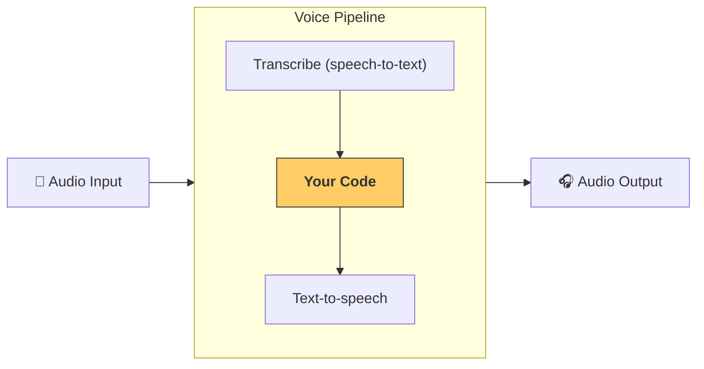

# Pipelines and workflows

[`VoicePipeline`][agents.voice.pipeline.VoicePipeline] is a class that makes it easy to turn your agentic workflows into a voice app. You pass in a workflow to run, and the pipeline takes care of transcribing input audio, detecting when the audio ends, calling your workflow at the right time, and turning the workflow output back into audio.
(【语音管道和工作流】
[`VoicePipeline`][agents.voice.pipeline.VoicePipeline] 是一个类，可以轻松将您的代理工作流转换为语音应用。您传入要运行的工作流，管道会负责转录输入音频、检测音频何时结束、在正确时间调用您的工作流，并将工作流输出转换回音频。)



## Configuring a pipeline
(## 配置管道)

When you create a pipeline, you can set a few things:
(创建管道时，您可以设置以下内容：)

1. The [`workflow`][agents.voice.workflow.VoiceWorkflowBase], which is the code that runs each time new audio is transcribed.
(1. [`workflow`][agents.voice.workflow.VoiceWorkflowBase]，这是每次新音频被转录时运行的代码)
2. The [`speech-to-text`][agents.voice.model.STTModel] and [`text-to-speech`][agents.voice.model.TTSModel] models used
(2. 使用的[`speech-to-text`][agents.voice.model.STTModel]和[`text-to-speech`][agents.voice.model.TTSModel]模型)
3. The [`config`][agents.voice.pipeline_config.VoicePipelineConfig], which lets you configure things like:
(3. [`config`][agents.voice.pipeline_config.VoicePipelineConfig]，允许您配置以下内容：)
    - A model provider, which can map model names to models
    (   - 模型提供者，可以将模型名称映射到模型)
    - Tracing, including whether to disable tracing, whether audio files are uploaded, the workflow name, trace IDs etc.
    (   - 追踪，包括是否禁用追踪、是否上传音频文件、工作流名称、追踪ID等)
    - Settings on the TTS and STT models, like the prompt, language and data types used.
    (   - TTS和STT模型的设置，如提示词、语言和使用的数据类型)

## Running a pipeline
(## 运行管道)

You can run a pipeline via the [`run()`][agents.voice.pipeline.VoicePipeline.run] method, which lets you pass in audio input in two forms:
(您可以通过[`run()`][agents.voice.pipeline.VoicePipeline.run]方法运行管道，该方法允许您以两种形式传入音频输入：)

1. [`AudioInput`][agents.voice.input.AudioInput] is used when you have a full audio transcript, and just want to produce a result for it. This is useful in cases where you don't need to detect when a speaker is done speaking; for example, when you have pre-recorded audio or in push-to-talk apps where it's clear when the user is done speaking.
(1. [`AudioInput`][agents.voice.input.AudioInput]用于当您有完整的音频转录时，只需为其生成结果。这在不需要检测说话者何时说完的情况下很有用；例如，当您有预录制的音频或在按下说话的应用程序中，用户何时说完很清楚)
2. [`StreamedAudioInput`][agents.voice.input.StreamedAudioInput] is used when you might need to detect when a user is done speaking. It allows you to push audio chunks as they are detected, and the voice pipeline will automatically run the agent workflow at the right time, via a process called "activity detection".
(2. [`StreamedAudioInput`][agents.voice.input.StreamedAudioInput]用于当您可能需要检测用户何时说完时。它允许您在检测到音频块时推送它们，语音管道将通过称为"活动检测"的过程在正确时间自动运行代理工作流)

## Results
(## 结果)

The result of a voice pipeline run is a [`StreamedAudioResult`][agents.voice.result.StreamedAudioResult]. This is an object that lets you stream events as they occur. There are a few kinds of [`VoiceStreamEvent`][agents.voice.events.VoiceStreamEvent], including:
(语音管道运行的结果是一个[`StreamedAudioResult`][agents.voice.result.StreamedAudioResult]。这是一个允许您在事件发生时流式传输的对象。有几种[`VoiceStreamEvent`][agents.voice.events.VoiceStreamEvent]，包括：)

1. [`VoiceStreamEventAudio`][agents.voice.events.VoiceStreamEventAudio], which contains a chunk of audio.
(1. [`VoiceStreamEventAudio`][agents.voice.events.VoiceStreamEventAudio]，包含一段音频)
2. [`VoiceStreamEventLifecycle`][agents.voice.events.VoiceStreamEventLifecycle], which informs you of lifecycle events like a turn starting or ending.
(2. [`VoiceStreamEventLifecycle`][agents.voice.events.VoiceStreamEventLifecycle]，通知您生命周期事件，如轮次开始或结束)
3. [`VoiceStreamEventError`][agents.voice.events.VoiceStreamEventError], is an error event.
(3. [`VoiceStreamEventError`][agents.voice.events.VoiceStreamEventError]，是一个错误事件)

```python

result = await pipeline.run(input)

async for event in result.stream():
    if event.type == "voice_stream_event_audio":
        # play audio
    elif event.type == "voice_stream_event_lifecycle":
        # lifecycle
    elif event.type == "voice_stream_event_error"
        # error
    ...
```

## Best practices
(## 最佳实践)

### Interruptions
(### 中断)

The Agents SDK currently does not support any built-in interruptions support for [`StreamedAudioInput`][agents.voice.input.StreamedAudioInput]. Instead for every detected turn it will trigger a separate run of your workflow. If you want to handle interruptions inside your application you can listen to the [`VoiceStreamEventLifecycle`][agents.voice.events.VoiceStreamEventLifecycle] events. `turn_started` will indicate that a new turn was transcribed and processing is beginning. `turn_ended` will trigger after all the audio was dispatched for a respective turn. You could use these events to mute the microphone of the speaker when the model starts a turn and unmute it after you flushed all the related audio for a turn.
(Agents SDK目前不支持对[`StreamedAudioInput`][agents.voice.input.StreamedAudioInput]的任何内置中断支持。相反，对于每个检测到的轮次，它将触发工作流的单独运行。如果您想在应用程序内处理中断，可以监听[`VoiceStreamEventLifecycle`][agents.voice.events.VoiceStreamEventLifecycle]事件。`turn_started`将指示新轮次已被转录且处理开始。`turn_ended`将在所有音频被分派给相应轮次后触发。您可以使用这些事件在模型开始轮次时静音扬声器的麦克风，并在刷新轮次的所有相关音频后取消静音)
