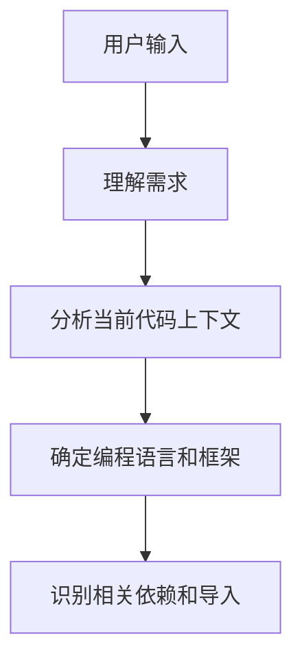
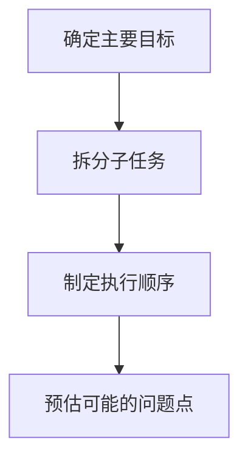
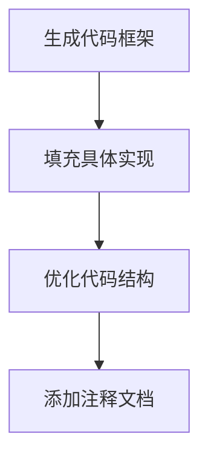
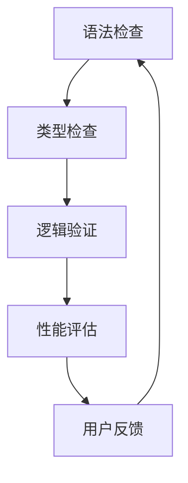
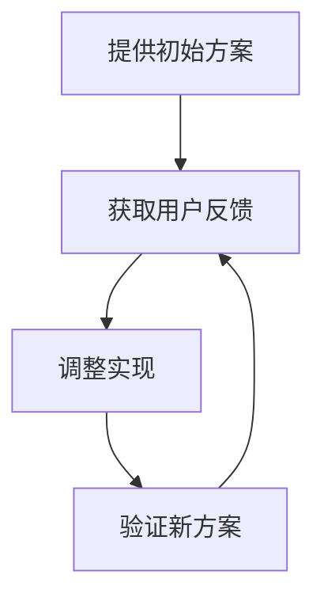
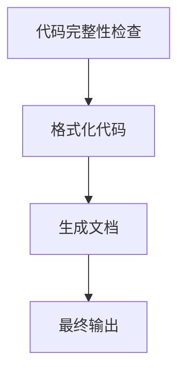
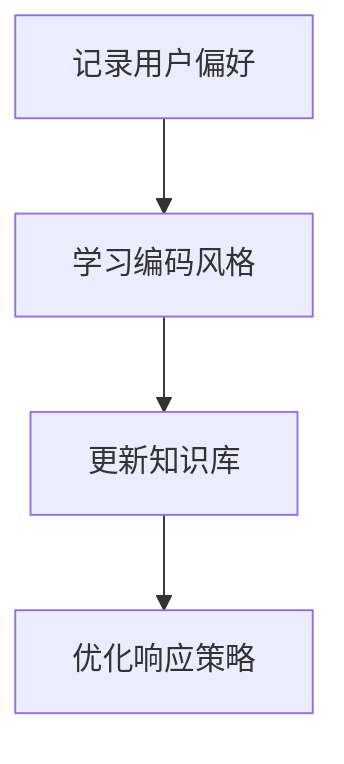

从 Cursor AI 的实际使用体验来看，它的工作逻辑可以更详细地分析如下：

### 1. 任务理解与上下文分析

- 理解用户的自然语言需求
- 分析当前打开文件的代码上下文
- 识别项目使用的编程语言、框架
- 检查相关的导入和依赖关系

### 2. 任务规划与分解

- 将复杂任务分解为可管理的子任务
- 确定子任务之间的依赖关系
- 规划执行顺序
- 预判可能遇到的问题

### 3. 代码生成与修改

- 生成初始代码框架
- 实现具体功能
- 优化代码结构和性能
- 添加适当的注释和文档

### 4. 实时验证与反馈

- 实时检查语法错误
- 验证类型匹配
- 确保逻辑正确性
- 评估代码性能
- 根据用户反馈调整

### 5. 交互式迭代

- 提供初始实现方案
- 接收用户反馈
- 根据反馈调整代码
- 持续优化直到满足需求

### 6. 结果整合与输出

- 确保代码完整性
- 统一代码格式
- 生成必要的文档
- 输出最终结果

### 7. 持续学习与适应

- 学习用户的编码风格
- 记录常用模式
- 适应项目特定需求
- 优化响应策略

### 核心特点：

1. **上下文感知**
   - 能够理解当前文件内容
   - 考虑项目整体结构
   - 保持代码一致性

2. **智能补全**
   - 提供实时代码建议
   - 自动补全函数和类
   - 智能变量命名

3. **交互式编程**
   - 支持自然语言交互
   - 提供多个解决方案
   - 根据反馈快速调整

4. **质量保证**
   - 自动代码审查
   - 性能优化建议
   - 安全性检查

这种工作逻辑使 Cursor AI 能够:
- 提供高质量的代码建议
- 保持代码的一致性和可维护性
- 提高开发效率
- 减少编程错误